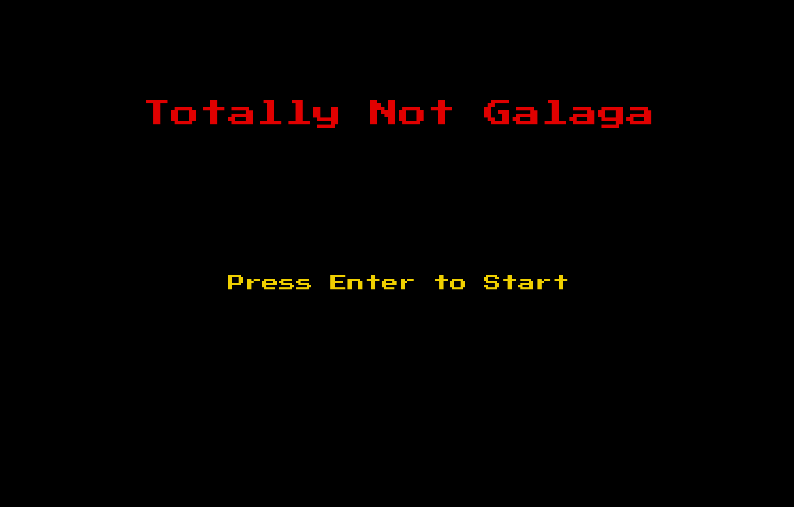
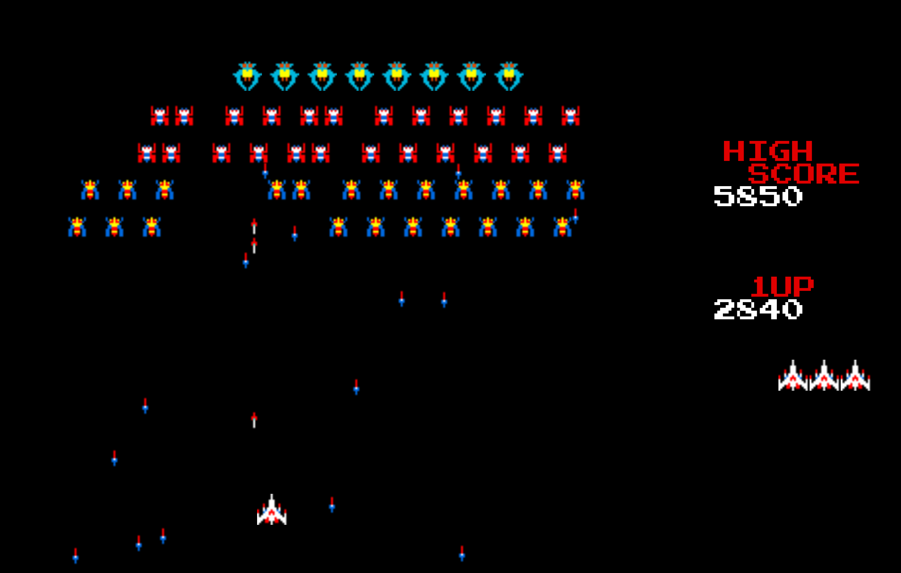
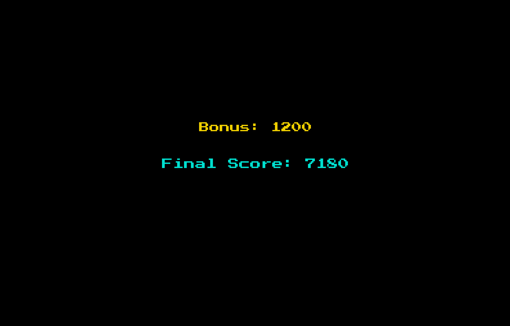

# Totally Not Galaga

---

## Overview
*Totally Not Galaga* is a Galaga clone with some variations.  Like Galaga, the player controls
a ship at the bottom of the screen with which you shoot the enemy bugs that come to attack you.

---

However, unlike Galaga, the bugs do not divebomb the player.  Instead, the bugs will enter from the top
and fire projectiles at the player as they move back and forth across the screen.
This changes the nature of the gameplay from classic Galaga, in that in *Totally Not Galaga*,
a large part of the gameplay strategy is to dodge the bug's projectiles, and fire at the bugs while doing so.

---

### The Player
The player has 3 lives available for each level, after beating a level, the remaining lives reset to 3.
The player's remaining lives are displayed on the right side of the screen, below the player's score.

---

### The Bugs
There are currently three different kinds of bugs, which are labeled in the code as *Type 1*, *Type 3*, and *Type 4*.
*Type 3* and *Type 4* are effectively the same from a gameplay perspective, but are different in appearance.
*Type 4*'s are the 'Boss' bugs, and take 3 hits to eliminate.

---

### Scoring
The scoring system works in the following way:
> - Eliminating *Type 3* and *Type 4* bugs gives the player 40 points.

> - Eliminating *Type 1* bugs gives the player 100 points.

> - Every player projectile that misses removes 5 points.  This gives the player an incentive to try to avoid missing.

> - After each playthrough (meaning the player has either lost or has beaten all the levels), the player is awarded a bonus which is added to their final score.  This bonus is equal to sum of all the lives the player had remaining after each level multiplied by 200.  Additionally, if the player manages to beat all the levels, they are awarded an addition 2000 points bonus.

---

## Screenshots

---

## Technologies Used
> - HTML
> - CSS
> - JavaScript

---

## Getting Started
Click the link below to play.  It will take you to the 'Menu' screen of the game.

[Totally Not Galaga](https://david-c-oliveros.github.io/Totally-Not-Galaga/)

> - Press 'Enter' once to start playing.

> - Use either the  'A' and 'D' keys or the arrow keys to move back and forth.

> - Use either the 'Spacebar' or the 'Numpad 0' to fire your projectiles.

> - When you eliminate all the bugs, you will be taken to a 'Beat Level' screen.  Press 'Enter' once to advance to the next level.

> - If you expend all of you lives, you will see a 'Game Over' screen.  Pressing 'Enter' once will take you to a score page that displays your final score, and pressing it again will take you back to the 'Menu' screen.

> - If you beat all the levels, after the 'Beat Level' screen, you will see a 'Win' screen.  Pressing 'Enter' will take you to the score screen.

> - On the score screen, pressing 'Enter' will take you back to the 'Menu' screen.

> - Once back on the 'Menu' screen, you can press 'Enter' to play again.

---

## Next Steps
### Planned Future Updates

> - Improve and add to the bugs' behaviour.

> - Add more levels and levelsets.

> - Create functionality for the levels to randomly generate, thereby eliminating the need to explicitly define them.

> - Add a boss level to the game.

> - Implement different game modes.
